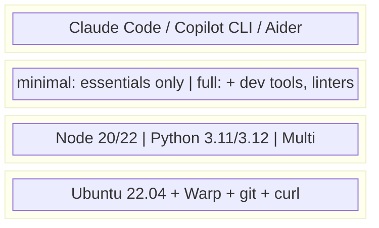

# Loom Tools

Pre-built Docker images for running AI coding agents with [Loom](https://github.com/mdlopresti/loom) infrastructure.

[](https://opensource.org/licenses/MIT)

## Overview

These images provide ready-to-use environments for running AI coding agents (Claude Code, Copilot CLI, etc.) in CI/CD pipelines like GitHub Actions. Each image includes:

- **Warp** - Loom's MCP server for agent communication
- **Agent CLI** - The AI coding assistant (Claude Code, etc.)
- **Runtime** - Language runtime(s) for the agent to use
- **Dev Tools** - Common development utilities

## Image Matrix

Images are tagged as: `ghcr.io/mdlopresti/loom-tools:{agent}-{runtime}-{variant}`

### Available Images

| Agent | Runtime | Variant | Tag | Size |
|-------|---------|---------|-----|------|
| Claude Code | Node 20 | minimal | `claude-node20-minimal` | ~500MB |
| Claude Code | Node 20 | full | `claude-node20-full` | ~800MB |
| Claude Code | Node 22 | minimal | `claude-node22-minimal` | ~500MB |
| Claude Code | Node 22 | full | `claude-node22-full` | ~800MB |
| Claude Code | Python 3.11 | minimal | `claude-python3.11-minimal` | ~600MB |
| Claude Code | Python 3.11 | full | `claude-python3.11-full` | ~900MB |
| Claude Code | Python 3.12 | minimal | `claude-python3.12-minimal` | ~600MB |
| Claude Code | Python 3.12 | full | `claude-python3.12-full` | ~900MB |
| Claude Code | Multi | minimal | `claude-multi-minimal` | ~1.0GB |
| Claude Code | Multi | full | `claude-multi-full` | ~1.2GB |

### Variants

| Variant | Contents |
|---------|----------|
| **minimal** | Agent + Runtime + git + essential tools |
| **full** | Everything in minimal + gh cli, jq, ripgrep, common linters |

### Runtimes

| Runtime | Description |
|---------|-------------|
| `node20` | Node.js 20 LTS |
| `node22` | Node.js 22 LTS |
| `python3.11` | Python 3.11 |
| `python3.12` | Python 3.12 |
| `multi` | Node 22 + Python 3.12 + Go 1.22 |

## Quick Start

### GitHub Actions

```yaml
name: AI Agent Task
on:
  workflow_dispatch:
    inputs:
      task:
        description: 'Task for the agent'
        required: true

jobs:
  agent:
    runs-on: ubuntu-latest
    container:
      image: ghcr.io/mdlopresti/loom-tools:claude-node20-full
    env:
      ANTHROPIC_API_KEY: ${{ secrets.ANTHROPIC_API_KEY }}
      NATS_URL: ${{ secrets.NATS_URL }}
      PROJECT_ID: ${{ github.repository }}
    steps:
      - uses: actions/checkout@v4
      - name: Run agent
        run: |
          # Start Warp in background
          warp &
          sleep 2

          # Run Claude Code with the task
          claude --task "${{ inputs.task }}"
```

### Local Development

```bash
# Pull the image
docker pull ghcr.io/mdlopresti/loom-tools:claude-node20-full

# Run interactively
docker run -it --rm \
  -e ANTHROPIC_API_KEY=$ANTHROPIC_API_KEY \
  -e NATS_URL=nats://localhost:4222 \
  -v $(pwd):/workspace \
  -w /workspace \
  ghcr.io/mdlopresti/loom-tools:claude-node20-full \
  bash
```

## Environment Variables

| Variable | Required | Description |
|----------|----------|-------------|
| `ANTHROPIC_API_KEY` | Yes (Claude) | API key for Claude |
| `NATS_URL` | Yes | NATS server URL (supports `nats://` and `wss://`) |
| `PROJECT_ID` | No | Project identifier for Loom isolation (default: `default`) |
| `AGENT_ID` | No | Custom agent ID (default: auto-generated UUID) |
| `AGENT_CAPABILITIES` | No | Comma-separated capabilities (default: from runtime) |

## Image Architecture



## Building Locally

```bash
# Build a specific image
./build.sh claude node20 full

# Build all images
./build.sh --all

# Build with custom registry
REGISTRY=myregistry.io ./build.sh claude node20 full
```

## Extending Images

Create a custom Dockerfile that extends these images:

```dockerfile
FROM ghcr.io/mdlopresti/loom-tools:claude-node20-full

# Add your project-specific tools
RUN npm install -g your-custom-tool

# Add custom configuration
COPY .claude-config /root/.config/claude/
```

## Example Workflows

Ready-to-use GitHub Actions workflows are available in [`.github/workflows/examples/`](.github/workflows/examples/). Copy these to your repository's `.github/workflows/` directory.

| Example | Description | Trigger |
|---------|-------------|---------|
| [Code Review Agent](https://github.com/mdlopresti/loom-tools/blob/main/.github/workflows/examples/code-review-agent.yml) | Automatically reviews pull requests | `pull_request` |
| [Issue Triage Agent](https://github.com/mdlopresti/loom-tools/blob/main/.github/workflows/examples/issue-triage-agent.yml) | Analyzes and labels new issues | `issues: opened` |
| [On-Demand Task Agent](https://github.com/mdlopresti/loom-tools/blob/main/.github/workflows/examples/on-demand-task-agent.yml) | Execute arbitrary tasks on demand | `workflow_dispatch` |
| [Scheduled Maintenance](https://github.com/mdlopresti/loom-tools/blob/main/.github/workflows/examples/scheduled-maintenance-agent.yml) | Weekly maintenance reports | `schedule` (cron) |
| [Loom Coordinated Agent](https://github.com/mdlopresti/loom-tools/blob/main/.github/workflows/examples/loom-coordinated-agent.yml) | Multi-agent coordination via Loom | `workflow_dispatch` |

### Security Considerations

All example workflows include security measures to prevent unauthorized usage:

1. **Author Association Checks**: PR and issue workflows verify the author is a collaborator, member, or owner
2. **Fork Protection**: PR reviews only run on non-fork PRs to prevent API key exposure
3. **Workflow Dispatch**: On-demand workflows can only be triggered by users with write access
4. **Scheduled Workflows**: Only run on the default branch (inherently safe)
5. **Concurrency Controls**: Prevent multiple simultaneous runs of the same agent

### Required Secrets

| Secret | Required For | Description |
|--------|--------------|-------------|
| `ANTHROPIC_API_KEY` | All workflows | Your Anthropic API key |
| `NATS_URL` | Loom coordination | NATS server URL (e.g., `nats://host:4222`) |
| `NATS_USER` | Optional | NATS authentication username |
| `NATS_PASS` | Optional | NATS authentication password |

## Roadmap

### Planned Agents
- [ ] GitHub Copilot CLI
- [ ] Aider
- [ ] Continue
- [ ] Cursor (if CLI available)

### Planned Runtimes
- [ ] Go 1.22
- [ ] Rust (latest stable)
- [ ] Java 21
- [ ] .NET 8

## Related

- [Loom](https://github.com/mdlopresti/loom) - Multi-agent infrastructure
- [Warp](https://github.com/mdlopresti/loom-warp) - MCP server for agent communication
- [Weft](https://github.com/mdlopresti/loom-weft) - Coordinator service

## License

MIT
